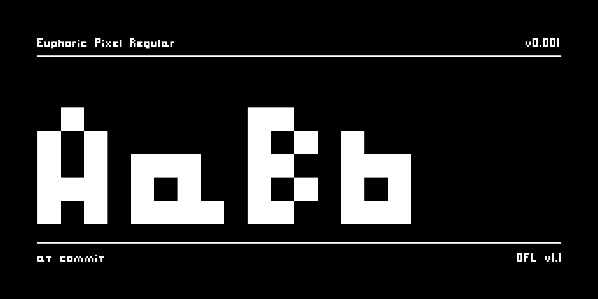

# Euphoric Pixel

高さ5ドットに収めた、小さなドットフォント。



- 大文字は高さ5ドット、小文字は x-height 3ドット・ascender 4ドット・descender 1ドット
- 幅は多くが3ドットで、m と w は5ドット、i と l は1ドット
- 角を丸めずに埋めた、四角いブロックの字形

## 収録文字

```
ABCDEFGHIJKLMNOPQRSTUVWXYZ
abcdefghijklmnopqrstuvwxyz
0123456789
.,!?-_:;'"()/@#&+=*
```

ほかにスペース(U+0020)とノーブレークスペース(U+00A0)。

## Web で使う

[fonts.euphoric.band](https://fonts.euphoric.band/euphoric-pixel/) で、いつも最新版を配っている。CSS を1行読み込めば使える。

```html
<link rel="stylesheet" href="https://fonts.euphoric.band/euphoric-pixel/euphoric-pixel.css">
```

```css
.pixel {
  font-family: "Euphoric Pixel", monospace;
  font-size: 16px; /* 8px の倍数 */
  line-height: 1;
}
```

1em が8ドットなので、`font-size` を 8px の倍数にすると1ドットがちょうど整数の px になり、にじまずに表示される。`line-height: 1` のとき、行の上下に1ドットずつ余白が付く。

## 字形を編集する

字形の元データは `sources/` のグリフシート。同じ名前の PNG と txt の組で、`sources/config.yaml` の `localMetadata.sheets` に並べた順に読む。

| ファイル | 収録文字 |
|---|---|
| `uppercase.png` / `.txt` | A–Z |
| `lowercase.png` / `.txt` | a–z |
| `digits.png` / `.txt` | 0–9 |
| `symbols.png` / `.txt` | 記号 |

- PNG は高さ6px。上5行がベースラインより上、一番下の1行がベースラインより下
- 黒 `#000000` が点、白か透明が空白。ほかの色が混ざるとビルドが止まる
- 文字は横1列に並べ、1列以上空けて区切る。文字の中に空いた列を作ると、そこで2文字に割れる
- 文字の間隔(1ドット)とスペースの幅は `sources/config.yaml` で決まるので、描かなくてよい
- txt には、PNG に並べた順に文字を1行で書く。PNG を切った文字数と txt の文字数が合わないとビルドが止まる

`scripts/png2ufo.py` がグリフシートから `sources/EuphoricPixel-Regular.ufo` を作り、そこから先は [gftools builder](https://github.com/googlefonts/gftools) と fontmake がビルドする。UFO は毎回作り直すので、直接は編集しない。

## ビルド

フォントは GitHub Actions が自動でビルドする。最新のビルドは Actions タブにある。

手元では Docker の中で make を走らせる。Python をホストに入れる必要はない。

```sh
scripts/docker-make build    # fonts/ にフォントを作る
scripts/docker-make test     # fontspector で検査する(universal プロファイル)
scripts/docker-make proof    # out/proof に HTML の proof を作る
scripts/docker-make images   # documentation/ の見本画像を作る
```

Python の依存を上げるときは `scripts/docker-make update` を走らせ、更新された `requirements.txt` をコミットする。

## リリース

リリースしたい PR の中で `sources/config.yaml` の `localMetadata.version` を上げる(`0.001` → `0.002` のように小数3桁)。その PR を main にマージすると、GitHub Actions がビルドし、その版のタグがまだ無ければタグ(`v` なしの `0.002`)と Release を作って、フォントの zip を付ける。版を上げずにマージしても、リリースはされない。

手でタグを push してもリリースできる。そのときは、タグとフォントの版が一致しないとビルドが止まる。

## Changelog

**2026-09-15 Version 0.001**

- 最初の版。A–Z、a–z、0–9、記号19字

## License

This Font Software is licensed under the SIL Open Font License, Version 1.1.
This license is available with a FAQ at https://openfontlicense.org

## Repository Layout

このリポジトリの構成は [Google Fonts Project Template](https://github.com/googlefonts/googlefonts-project-template) に合わせている。
